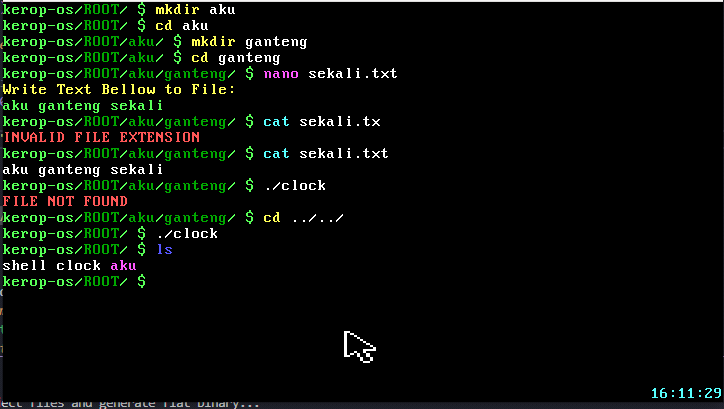

# Tugas Besar Sistem Operasi 2024 / Kerop-OS

## Anggota
| No. | Nama                    | NIM      |
| --- |:-----------------------:| --------:|
| 1   | Maulana Muhamad Susetyo | 13522127 |
| 2   | Hugo Sabam Augusto      | 13522129 |
| 3   | Muhammad Dzaki Arta     | 13522149 |
| 4   | Albert Ghazaly          | 13522150 |

## Snapshots

## Table of Contents
* [Anggota](#anggota)
* [Deskripsi Program](#deskripsi-program)
* [Technologies Used](#technologies-used)
* [Prerequisite](#prerequisite)
* [How to Run](#how-to-run)
* [Acknowledgements](#acknowledgements)

## Deskripsi Program
Program menjalankan Operating System berbasis x86 32-bit Protected Mode yang berjalan pada emulator QEMU

Milestone 1
- Text Framebuffer
- Interrupt
- Keyboard Driver
- Filesystem

Milestone 2
- Manajemen Memory
- Separasi Kernel-User Space
- Shell

Milestone 3
- Menyiapkan struktur untuk Proses
- Task Scheduler & Context Switch
- Perintah Shell untuk Manajemen Proses
- Multitasking dengan Clock

## Technologies Used
1. Windows Subsytem for Linux
2. Netwide Assembler
3. GNU C Compiler
4. GNU Linker
5. QEMU - System i386
6. GNU Make
7. genisoimage
8. GDB
9. Visual Studio Code

## Prerequisite
1. Install Visual Studio Code in Windows
   `winget install microsoft.visualstudiocode`
2. Install Toolchain in WSL
   `sudo apt update
    sudo apt install -y nasm gcc qemu-system-x86 make genisoimage gdb`

## How to Run
1. Clone this Repository into WSL
  `https://github.com/labsister21/os-2024-kerop-os.git`
2. Change Directory to this repository 
  `cd os-2024-kerop-os`
3. Make run
  `make run`  

## Acknowledgements
1. Tuhan Yang Maha Esa
2. Dosen Sistem Operasi
3. Asisten LabSister (+ pol)
